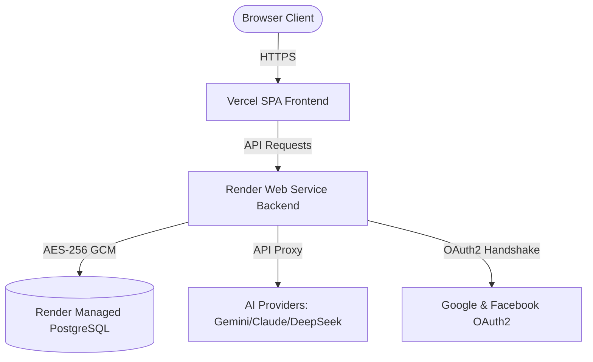

# 🚀 Production Deployment Guide — Namastute SaaS

> **Official Cloud Deployment Playbook** · v1.5 · May 2026  
> Complete steps to deploy the **Namastute** frontend client to **Vercel**, and the Spring Boot backend server and PostgreSQL database to **Render**.

---

## 1. Cloud Infrastructure & Service Topology



---

## 2. Database Provisioning (Render PostgreSQL)

1. Sign in to your [Render Dashboard](https://dashboard.render.com).
2. Click **New +** → **PostgreSQL**.
3. Configure the database parameters:
   * **Name:** `namustutam_db`
   * **Database:** `otp_auth_db`
   * **Region:** Choose the region closest to your target user base.
   * **Plan:** Free or Starter depending on your transaction volumes.
4. Click **Create Database**.
5. Once active, copy the **Internal Database URL** (for backend running within Render) or **External Database URL** (for remote administration).

---

## 3. Backend Deployment (Render Web Service)

### A. Environment Variable Configuration
In your Render Service Dashboard, navigate to **Environment** and add the following key-value pairs to hook the Spring Boot engine to the DB and enable secure operations:

| Variable Name | Recommended Value / Origin | Description |
| :--- | :--- | :--- |
| `SERVER_PORT` | `3000` | Target port for Spring Boot Tomcat container. |
| `SPRING_DATASOURCE_URL` | `jdbc:postgresql://<DB_HOST>:5432/otp_auth_db?sslmode=require` | Use the Connection URL provided by Render. |
| `SPRING_DATASOURCE_USERNAME` | `<DB_USER>` | Your PostgreSQL database user. |
| `SPRING_DATASOURCE_PASSWORD` | `<DB_PASSWORD>` | Your PostgreSQL database password. |
| `JWT_SECRET` | `404E635266556A586E3272357538782F413F4428472B4B6250645367566B5970` | Hex key (at least 256-bit) to sign stateless JWT sessions. |
| `JWT_EXPIRATION` | `86400000` | Expiration time of the JWT in milliseconds (24 hours). |
| `AI_ENCRYPTION_SECRET` | `6a7b8c9d0e1f2a3b4c5d6e7f8a9b0c1d2e3f4a5b6c7d8e9f0a1b2c3d4e5f6a7b` | **CRITICAL:** 256-bit Hex key used to securely encrypt user AI API keys. |
| `APP_BASE_URL` | `https://springboot-app-pb1v.onrender.com` | Your live Render backend URL. |
| `FRONTEND_URL` | `https://saa-s-namastute.vercel.app` | Your live Vercel frontend client domain URL. |
| `CORS_EXTRA_ORIGINS` | `http://localhost:5173,http://localhost:5174` | Commas-separated list of secondary domains allowed to bypass CORS. |
| `SUPER_ADMIN_EMAIL` | `admin@gmail.com` | Primary Super Admin email. |
| `SUPER_ADMIN_PASSWORD` | `Admin@12345` | Primary Super Admin password. |
| `SPRING_SECURITY_OAUTH2_CLIENT_REGISTRATION_GOOGLE_CLIENT_ID` | `YOUR_GOOGLE_CLIENT_ID` | OAuth2 Google client key for login. |
| `SPRING_SECURITY_OAUTH2_CLIENT_REGISTRATION_GOOGLE_CLIENT_SECRET` | `YOUR_GOOGLE_CLIENT_SECRET` | OAuth2 Google client secret key. |
| `SPRING_SECURITY_OAUTH2_CLIENT_REGISTRATION_FACEBOOK_CLIENT_ID` | `YOUR_FACEBOOK_CLIENT_ID` | OAuth2 Facebook client key. |
| `SPRING_SECURITY_OAUTH2_CLIENT_REGISTRATION_FACEBOOK_CLIENT_SECRET` | `YOUR_FACEBOOK_CLIENT_SECRET` | OAuth2 Facebook client secret. |

> [!IMPORTANT]  
> Make sure `AI_ENCRYPTION_SECRET` is static and securely backed up. If this secret is lost or changed in a future redeployment, any previously saved user AI API keys in the database will fail to decrypt, and users will have to re-enter them in their settings page.

### B. Deployment & Build Parameters
1. Click **New +** → **Web Service** on Render.
2. Select your imported GitHub Repository.
3. Configure the build parameters:
   * **Root Directory:** `backend`
   * **Runtime:** `Docker` (if using Dockerfile) or `Java`
   * **Build Command:** `mvn clean package -DskipTests`
   * **Start Command:** `java -jar target/*.jar`
4. Click **Deploy Web Service**.

---

## 4. Frontend Deployment (Vercel SPA)

Vercel serves as our high-speed content delivery network (CDN) host for the React client assets.

### A. Environment Variables Setup
Under **Project Settings** → **Environment Variables** in Vercel, add the following variables:

| Variable Key | Value | Purpose |
| :--- | :--- | :--- |
| `VITE_API_BASE_URL` | `https://springboot-app-pb1v.onrender.com/api` | Direct target for client Axios request calls. |
| `VITE_BACKEND_BASE_URL` | `https://springboot-app-pb1v.onrender.com` | Base backend domain for static asset resolving (like `/uploads`). |
| `VITE_FRONTEND_URL` | `https://saa-s-namastute.vercel.app` | Callback domain mapping target for authentication redirects. |
| `VITE_APP_NAME` | `Namastute POS` | Application header branding string. |
| `VITE_APP_VERSION` | `1.0.0` | Client build version. |
| `VITE_ENABLE_GOOGLE_LOGIN` | `true` | Show/Hide the Google Login gateway option. |
| `VITE_ENABLE_FACEBOOK_LOGIN` | `true` | Show/Hide the Facebook Login gateway option. |
| `VITE_ENABLE_BLOG` | `true` | Toggle the blog modules. |

### B. Build Commands
* **Root Directory:** `frontend`
* **Framework Preset:** `Vite` (Vercel will auto-detect Vite settings)
* **Build Command:** `npm run build`
* **Output Directory:** `dist`

### C. Client SPA Routing Configuration
Vite uses HTML5 History API client-side routing. To avoid **404 Page Not Found** errors when users refresh their browser tabs on nested routes (e.g. `/dashboard/sales`), we route all endpoints back to `index.html`. This rewrite is handled by the pre-configured [vercel.json](file:///c:/Users/aksha/OneDrive/Desktop/Namustutam/SaaS-namastute/frontend/vercel.json) file:

```json
{
  "rewrites": [{ "source": "/(.*)", "destination": "/index.html" }]
}
```

---

## 5. Google Cloud Console OAuth2 Configuration

To utilize Google Social Login, you must register your authorized credentials:

1. Visit [Google Cloud Console Credentials](https://console.cloud.google.com/apis/credentials).
2. Choose your active POS project (or create a new one).
3. Under **OAuth 2.0 Client IDs**, create or edit your credentials.
4. Set the following redirect and origin scopes:
   * **Authorized JavaScript Origins:**
     * `https://saa-s-namastute.vercel.app` *(Production Client)*
     * `https://springboot-app-pb1v.onrender.com` *(Production API)*
     * `http://localhost:5173` *(Local Dev Client)*
   * **Authorized Redirect URIs (Redirect Handshake Callback):**
     * `https://springboot-app-pb1v.onrender.com/login/oauth2/code/google` *(Prod Target)*
     * `http://localhost:3000/login/oauth2/code/google` *(Dev Target)*

---

## 6. Pre-flight Verification Checklist

After deploying all components, execute these manual tests to confirm operation:

* [ ] **Landing Page Loader:** Navigate to `https://saa-s-namastute.vercel.app`. Confirm pages load without visual errors.
* [ ] **Secure Login:** Log in using the admin account (`admin@gmail.com` / `Admin@12345`). Validate redirect to `/dashboard`.
* [ ] **Deep-Link Persistence:** Navigate to `/settings` and hit **F5** (Hard Reload). The browser must reload the page without a Vercel 404 error.
* [ ] **CORS Preflight:** Open your browser DevTools Console. Perform an action like adding a product. Ensure no CORS errors appear.
* [ ] **AI Assistant Connection:** Go to **Settings** → **AI Settings**, enter a valid key, and run a preflight test. Ensure the response says: `✅ Connection successful!`.

---

## 7. Troubleshooting Common Failures

### 1. CORS Preflight Blocks (`Access-Control-Allow-Origin` Mismatch)
* **Cause:** The live backend does not recognize the frontend origin.
* **Fix:** Update the `CORS_EXTRA_ORIGINS` and `FRONTEND_URL` variables on Render to match your exact Vercel address. Ensure there is no trailing slash (`/`).

### 2. User AI Assistant Key Fails to Load or Corrupts
* **Cause:** The backend was redeployed without a static `AI_ENCRYPTION_SECRET`, generating an ad-hoc boot key that cannot decrypt database values.
* **Fix:** Manually assign a static 256-bit hexadecimal string to the `AI_ENCRYPTION_SECRET` environment variable in your Render dashboard settings and redeploy.

### 3. Vercel Redeployment Env Delay
* **Cause:** Vite environment variables are baked into static Javascript bundles during compile time.
* **Fix:** Setting new variables in the Vercel panel requires triggering a **Manual Redeploy** or pushing a new commit for the variables to take effect in the browser.

---

*Namastute POS Cloud Ops — v1.5 · Engineered for Scalability.*
